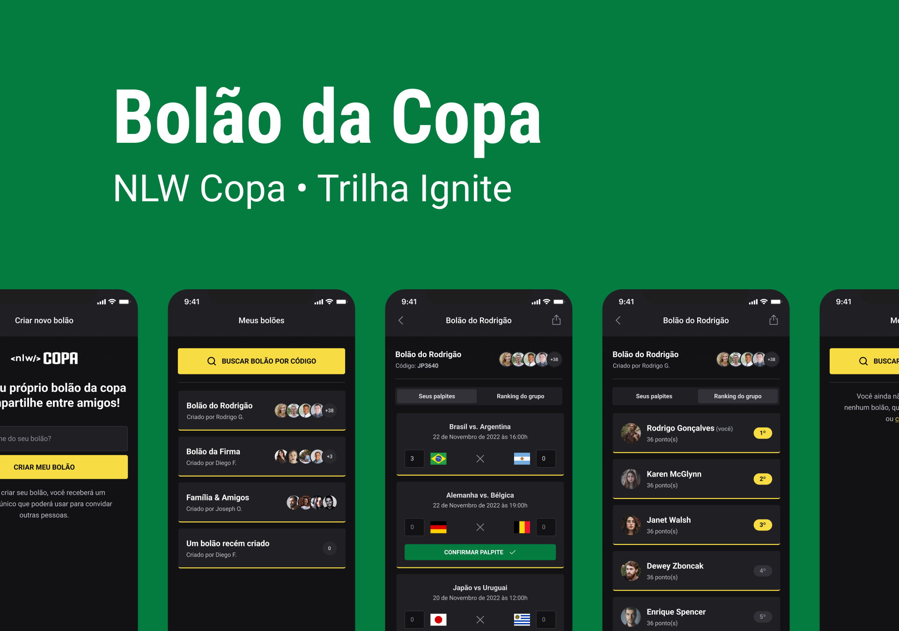

<br/>

<h4 align="center"> 
	🚧  Em construção...  🚧
</h4>

<br/>

# Bolão da Copa (Next Level Week)


<span id='sobre-o-projeto'></span>
## 🖥️ Sobre o projeto

=================

Este projeto foi desenvolvido durante a NLW-copa, um evento gratuito totalmente mão na massa proporcionado pela <link to='https://rocketseat.com.br' target='_blank'>Rocketseat</link>. Este projeto conta com um servidor feito em Node.js, uma versão web feita utilizando Next.js e uma aplicação mobile desenvolvida com React Native. 

Em clima de copa, está aplicação foi pensada pra trazer a oportunidade de que o usuário crie seus próprios bolões da Copa do mundo de 2022 e os compartilhe com amigos, colegas e familiares (ou basicamente com quem ele desejar).


Na aplicação web o usuário poderá criar o seu próprio bolão, enquanto que na versão mobile ele poderá realizar qualquer das ações abaixo

* Realizar autenticação social com o Google
* Criar o própio bolão
* Buscar bolões existentes a partir de um código único de 6 dígitos
* Navegar entre os bolões que já é participante
* Realizar palpites em qualquer jogo dentro dos bolões em que já participa
* Visualizar a pontuação e o ranking dos participantes dos bolões que participa
* Escolher o método de pagamento dentre as opções disponíveis.

<div id='tabela-de-conteudo'></div>

## 📋 Sumário
=================
<!--ts-->
   * [Sobre o Projeto](#sobre-o-projeto)
   * [Tabela de Conteúdos](#tabela-de-conteudo)
   * [Tecnologias](#tecnologias)
   * [Pré-requisitos](#pre-requisitos)
   * [Como rodar a aplicação web](#como-rodar-a-aplicacao-web)
   * [Visite esta aplicação em meu portfólio](#aplicação-no-portfolio)

<!--te-->

<span id='tecnologias'></span>
## ⚒️ Tecnologias
=================

As seguintes ferrametnsa foram usadas na construção do projeto:
<ul>
  <li> <a href='https://nextjs.org/' target='_blank'> Next </a></li>
  <li> <a href='https://reactnative.dev/' target='_blank'> React Native </a></li>
  <li> <a href='https://www.typescriptlang.org/' target='_blank'> Typescript </a></li>
  <li> <a href='https://tailwindcss.com/' target='_blank'> Tailwindcss </a></li>
  <li> <a href='https://www.prisma.io/' target='_blank'> Prisma </a></li>
  <li>
    <div>
      Algumas das ferramentas utilizadas:
      <ul>
        <li>
          <a href='https://www.fastify.io/' target='_blank'>Fastify</a>
        </li>
        <li>
          <a href='https://expo.dev/' target='_blank'>Expo </a>
        </li>
        <li>
          <a href='https://nativebase.io/' target='_blank'>Native Base </a>
        </li>
        <li>
          <a href='https://github.com/phosphor-icons/phosphor-react' target='_blank'>Phosphor React Native </a>
        </li>
        <li> 
          <a href='https://immerjs.github.io/immer/' target='_blank'>immer </a>
        </li>
        <li>
          <a href='https://github.com/colinhacks/zod' target='_blank'>zod </a>
        </li>
      </ul>
    </div>
  </li>
</ul>

<span id='pre-requisitos'></span>

## ✅ Pré-requisitos
=================

Antes de começar, você vai precisar ter instalado em sua máquina as seguintes ferramentas:
* [Git](https://git-scm.com)
* [Node.js (v18.12.0)](https://nodejs.org/en/)
* [VSCode](https://code.visualstudio.com/) (Editor sugerido)

<span id='como-rodar-a-aplicacao-web'></span>

## ⚙️ Como rodar a aplicação
=================
```bash
# Clone este repositório
$ git clone https://github.com/jp2mesquita/nlw-Copa
```

Em seguida configure as variáveis de ambiente para que a aplicação funcione.

```bash
#Para o servidor adicione um arquivo .env na raiz do projeto e preencha com:
DATABASE_URL="file:./dev.db"

#Para a aplicação mobile adicione  um arquivo .env na raiz do projeto e preencha com:
CLIENT_ID='preencha aqui o seu Id'

#Está etapa exige um pouco de pesquisa para poder configurar o OAuth com o google pois o valor da chave acima é único por usúario.
```
Após conseguir sua CLIENT_ID

Rodando o server
```bash
#Acesse a pasta server no terminal/cmd e instale as dependências
$ npm install

#Inicie o servidor com
$ npm run dev

```
Rodando a versão Web

```bash
#Acesse a pasta nlw-copa-web no terminal/cmd, instale as dependências e rode o projeto

$ npm install
$ npm run dev

```

Rodando a versão Mobile, mais uma vez é importante que saiba como lidar com aplicações desenvovidas com expo para que visualize o resultado em seu aparelho ou em seu emulador
```bash
#Acesse a pasta nlw-copa-mobile no terminal/cmd, instale as dependências e rode o projeto
$ npm install
$ npm run start
```

</br>

<span id='aplicação-no-portfolio'></span>

aplicação-no-portfolio
## 💼 Visite esta aplicação em meu portfólio
=================

Para acessar está aplicação em meu portfólio e ver outros projetos desenvolvidos por mim acesse o link:

<a href='https://portfolio-thebrabus.vercel.app' target='_blank'>
  TheBrabus Portifolio 🔗
</a>

</br>
</br>

## 🧔 Autor
=================

<a href="https://linkedin.com/in/jp2mesquita/" target="_blank">
 
 <br />
Desenvolvido com 💜 por João Paulo Mesquita

<br/>

[](https://www.linkedin.com/in/jo%C3%A3o-paulo-mesquita-02a4a3179/)  [](mailto:jp-mesquita@live.com)

